<div align="center">


<a href="https://git.io/typing-svg">
  
</a>

<br/><br/>


&nbsp;
<a href="https://github.com/nilotpaldhar2004?tab=followers">
  
</a>
&nbsp;

&nbsp;

&nbsp;


</div>

---

## 👤 About Me

```python
nilotpal = {
    "name"        : "Nilotpal Dhar",
    "role"        : ["Deep learning", "Machine learning Engineer", "Open Source Developer"],
    "education"   : "B.Tech CSBS — Academy of Technology, West Bengal (2023–2027)",
    "current"     : "6th Semester  ← still in college, already in production",
    "kaggle"      : "Expert 🏆  — competition medals & high-ranking finishes",
    "pypi"        : "datadiagnose  — zero-dependency ML dataset diagnosis library",
    "location"    : "West Bengal, India 🇮🇳",
    "stack"       : ["Python", "PyTorch", "Scikit-Learn", "FastAPI", "SQL"],
    "live_apps"   : "5 deployed ML projects  — each with a public URL & live backend",
    "available"   : True,
    "looking_for" : ["Full-Time Data Scientist / ML Engineer", "Freelance AI Consulting"],
    "contact"     : "dharnilotpal31@gmail.com",
}
```

I'm a **Data Scientist and ML Engineer** in my 6th semester of Computer Science & Business Systems — and I've already shipped more production ML systems than most graduates.

I hold **Kaggle Expert** status earned through competition medals and real-world dataset finishes. I've built and deployed **5 live ML applications** covering fraud detection, medical imaging, rent prediction, churn analysis, and NLP recommendation — every single one has a live URL and a FastAPI backend on Render, not just a notebook.

I'm also the author of **[DataDiagnose](https://pypi.org/project/datadiagnose/)** — a Python library published on PyPI with zero external dependencies. It auto-diagnoses ML datasets, scores dataset health from 0–100, and recommends the right model type before training begins. Built from scratch using only the Python standard library. 140-test suite. MIT licensed.

> **My standard:** Does it solve a real problem? Does it work reliably in production? If yes — ship it.

---

## 🚀 Live Deployed Projects

> Every project below has a **live URL** — FastAPI backend on Render, frontend on Vercel or GitHub Pages.

| # | Project | What it does | Tech | Links |
|:-:|:--------|:-------------|:-----|:------|
| 1 | 🔬 **DermSight PRO** | ResNet-50 skin lesion classifier · 85%+ acc · 7 ISIC classes · HAM10000 dataset | PyTorch · FastAPI · ResNet-50 | [](https://github.com/nilotpaldhar2004/DermSight-AI-Deep-Learning-for-Skin-Lesion-Classification) [](https://nilotpaldhar2004.github.io/DermSight-AI-Deep-Learning-for-Skin-Lesion-Classification/) |
| 2 | 🛡️ **FraudGuard AI** | Real-time credit card fraud detection microservice with live dashboard | LightGBM · FastAPI · Vercel | [](https://github.com/nilotpaldhar2004/Credit-Card-Fraud-Detection) [](https://finsec-dashboard-silk.vercel.app) |
| 3 | 🏠 **RentIQ** | AI rent forecasting across 6 Indian metro cities using tuned XGBoost | XGBoost · FastAPI · GitHub Pages | [](https://github.com/nilotpaldhar2004/Indian-city-rent-predictor) [](https://nilotpaldhar2004.github.io/Indian-city-rent-predictor/) |
| 4 | 📡 **RevenueShield ML** | Telecom churn predictor with real-time risk scoring web app | Random Forest · FastAPI | [](https://github.com/nilotpaldhar2004/Telecom-AI-Predictor) [](https://nilotpaldhar2004.github.io/Telecom-AI-Predictor/) |
| 5 | 🎬 **Movie Recommender** | NLP content-based recommender · Streamlit dashboard · 5,000-movie corpus | NLP · Scikit-Learn · Streamlit | [](https://github.com/nilotpaldhar2004/movie-recommender-system) [](https://nilotpaldhar2004.github.io/movie-recommender-system/) |

---

## 📦 Open Source — DataDiagnose

<div align="center">

[](https://pypi.org/project/datadiagnose/)
[](https://pypi.org/project/datadiagnose/)
[](https://github.com/nilotpaldhar2004/datadiagnose/blob/main/LICENSE.txt)
[](https://pypi.org/project/datadiagnose/)
[](https://github.com/nilotpaldhar2004/datadiagnose)

</div>

```bash
pip install datadiagnose
```

```python
from datadiagnose import DataDiagnose
import pandas as pd

report = DataDiagnose(pd.read_csv("dataset.csv")).diagnose()
# → health score 0–100, detected issues, model type recommendations
```

Detects: **missing values · duplicates · class imbalance · data leakage · high cardinality · skewed features · outliers · constant columns**

[](https://pypi.org/project/datadiagnose/)
[](https://github.com/nilotpaldhar2004/datadiagnose)

---

## 🎓 Certifications

| Issuer | Certificate | Status |
|:-------|:------------|:-------|
| **Oracle** | Cloud Infrastructure **Data Science Professional** | [](https://catalog-education.oracle.com/ords/certview/sharebadge?id=46E7BE4F8D11DD78A31A08C5CF83A595D26E68334599294AAED48EA7726E64B4) |
| **Oracle** | Cloud Infrastructure **AI Foundations Associate** | [](https://catalog-education.oracle.com/pls/certview/sharebadge?id=B6F003F5C71782785DC7ADD7E4AD6DDBE0EE4C4BFE87C128EA255AAB8FB48879) |
| **LinkedIn & Microsoft** | Career Essentials in **Data Analysis** | [](https://www.linkedin.com/learning/certificates/a15dc9f6575c2e9ad3bc5bcacb51832013eadcd080b77b6649edb108713369b6) |
| **IBM — Cognitive Class** | **Python 101** for Data Science | [](https://courses.cognitiveclass.ai/certificates/11ca487cc6dc4cb582dbd91987d9434b) |
| **Udemy** | NumPy · SciPy · **Matplotlib** · Pandas | [](https://www.udemy.com/certificate/UC-e869d7f9-8c15-4fd3-ab2d-b11911c6c770/) |

---

## 🛠️ Tech Stack

<div align="center">

**Languages**


**ML / Deep Learning / Data Science**


**Deployment & APIs**


**Databases & Tools**


</div>

---

## 📊 GitHub Stats

<div align="center">

<!--
  SVGs are generated daily by .github/workflows/stats.yml
  and committed to assets/ — no external server dependency.
-->


<br/>


</div>


## 📈 Contribution Graph

<div align="center">

</div>

---

## 🏆 GitHub Trophies

<div align="center">

</div>

---

## 🤝 Connect

<div align="center">

[](https://nilotpal-dhar.vercel.app)
&nbsp;
[](https://www.linkedin.com/in/nilotpal-dhar-24b304294/)
&nbsp;
[](https://www.kaggle.com/nilotpaldhar)
&nbsp;
[](mailto:dharnilotpal31@gmail.com)

&nbsp;

[](https://leetcode.com/u/nilotpalDhar/)
&nbsp;
[](https://instagram.com/nil_dhar_04)
&nbsp;
[](https://www.facebook.com/profile.php?id=61574126100154)
&nbsp;
[](https://x.com/nilot15996)

</div>

---

<div align="center">


<sub>
  <b>Seeking full-time Data Scientist / ML Engineer roles and freelance AI consulting opportunities.</b><br/>
  From raw data to a deployed, working solution — I'm ready.
</sub>

</div>
